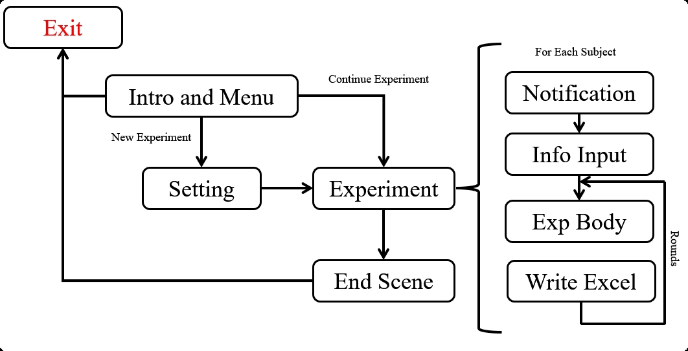

# ErgoLabUnity - Ergonomics Experiment Framework for Unity

**本项目仍在开发阶段**

## 简介 Introduction

本仓库使用**Unity 2021**构建了一个通用的进行**人机工效学、心理学**等需要**人类被试**参与的实验程序框架。提供了常用UI组件预制体Prefab(按钮、滚动文本框、暂停菜单等)、一些常用的人机交互硬件驱动、以及实验数据记录管理系统。

Unity版本：2021.3.19f1c1。相差不多的版本也可以使用。

## 如何使用 Usage

项目仓库为Unity工程文件，可以按照以下流程使用：

1. 在本地新建一个**空Unity项目**，模板选择**2D**。
2. **Clone**本仓库文件到项目目录下，覆盖文件。
3. 根据实验需求更改模板内容。主要需要修改```/Asserts/Scene/ExperimentScene```中实验部分。

## 结构 Structure

框架图如下：



其中每个部分使用场景Scene来管理功能模块，不同的功能切换时加载对应场景Scene。

目前包含以下Scene：

1. **IntroAndMenu**: 开始菜单场景
2. **Setting**：设置Scene，包括实验参数、程序分辨率、帧率等参数。
3. **Experiment**：实验主场景。
4. **Notification**：告知被试实验相关内容场景。
5. **LoadingScene**：场景间切换的 Loading 界面。

## 进一步开发 Further development


### 场景 Scene 

#### 添加场景 Add Scene

为了实现切换场景间的```Loading```界面，以及解决一些加载产生的卡顿。重写封装了场景切换脚本，在```SceneController.cs```脚本内方法进行场景间的切换调度。

在添加了新的场景后需要在```/Asserts/Script/Flow Management/SceneController.cs```文件中手动添加新场景名称到场景列表。并管理场景顺序。如下：

```cs
// 场景列表数组，这里按顺序填写已经存在的scene的场景名。
    public static ArrayList sceneNames = new ArrayList() {
        "Scene_0",
        "Scene_1",
        "IntroAndMenu",
        "Notification",
        "Scene_-1",
    };
```

之后还需把新添加的场景添加到Unity中的Building Setting中。

#### 切换场景 Switch Scene

需要切换场景时使用在```FlowControl.cs```中封装的以下方法：

```cs
public static void PreviseScene()//上一个场景
public static void NextScene()//下一个场景
public static void Exit()//退出程序
```
更加灵活的切换场景可以使用在```SceneController.cs```中的方法：

```cs
SceneController.GoToNextScene();//切换下一个场景
SceneController.GoToPrevScene();//切换上一个场景
SceneController.GoToSceneByIndex(int Sceneindex);//通过引索切换场景
SceneController.GoToSceneByName(string Scenename);//通过名称切换场景
```

其中Sceneindex下标从0开始。

### 设置 Setting

#### 读取设置 Read Setting

使用如下的代码来读取当前保存的设置内容：

```cs
// Read settings
Setting = JsonFile.ReadSetting();

// Get Setting Use Name 
Setting_1 = Setting["Setting_1"];
...
```

#### 增加新的设置 Add New Setting

程序设置使用.json文件来保存。文件位于/Asserts/Data/Setting.json

需要增加新的设置类别时按照以下流程：

1. 在```JsonFile.cs```脚本中的 ```Setting``` 类中增加新的属性，目前仅支持```int``` 类型的设置参数。
2. 在```Setting```场景中制作新设置属性的组件，如Select Bar或Input Box等。
3. 在```SettingSceneController.cs```脚本中的```ApplyButton()```函数中的```Setting()```类中添加写入新设置属性的内容。注意变量类型为```int```。
